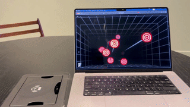

# WindowMode
The is a demo of True3D labs' "window mode". Check out the live demo [here](https://lab.true3d.com/targets). 

This is a NextJS project. The core funcionality driving the demo can be found at `components/WindowModeDemoPage.tsx`. We also use a small web worker for offloading tasks to a background thread, this can be found at `components/LandmarkWorker.tsx`. The file containing the 3D scene we render is stored at `public/target_visualization.vv`. `.vv` (voxel volume) is our file format for voxel-based 3D static scenes. More on this in "How do we render the scene."

## What is window mode?
Window mode is a 3D camera controller that emulates a window into the virtual world. You can imagine that your computer screen is really a portal into a 3D space.

It works by tracking the position of your face relative to the webcam, then re-rendering the 3D scene from the perspective of your face. This gives off the illusion that the 3D scene is really there, behind the screen, without the need for specialized hardware.

## How does it work?
Here we use [MediaPipe](https://www.npmjs.com/package/@mediapipe/tasks-vision)'s `FaceLandmarker` system to extract the positions of the user's eyes. We use the apparent diameter of the eyes, along with the webcam's FOV in order to estimate the distance of the user's head from the webcam. We can then get an accurate estimate for the metric position of the user's eyes, relative to the webcam. 

Once we have the position of the users' face, we compute an *off-axis projection matrix*. This is a matrix transforming camera-relative coordinates to screen coordinates. It is what simulates the "portal" effect. This is done within our `spatial-player` library. For more information read [this article](https://en.wikibooks.org/wiki/Cg_Programming/Unity/Projection_for_Virtual_Reality). We will also be posting a video explainer to our [YouTube channel](https://www.youtube.com/@true3dlabs) soon.

## How do we render the scene?
All the rendering for this demo is done with our `spatial-player` library. You can install it on `npm` [here](https://www.npmjs.com/package/spatial-player). `spatial-player` is our framework for working with voxel-based 3D videos and static scenes. 

The targets are stored in a `.vv` (voxel volume) file. This is our file format for static, voxel-based 3D scenes. `spatial-player` also supports realtime rendering and playback of 3D volumetric videos, this is how our [Steamboat Willie Demo](https://www.splats.com/watch/702?window_mode=true&start_time=21) is rendered. Our volumetric videos are stored in `.splv` files.

You can render `.splv`s with `spatial-player`. If you want to create `.splv`s or `.vv`s to render, you should check out our python package `spatialstudio`. You can `pip` install it, check out the [documentation](https://pypi.org/project/spatialstudio/). If you have any questions/suggestions/requests for us or our stack, reach out to us on [discord](https://discord.gg/seBPMUGnhR).

Currently `spatial-player` and `spatialstudio` are only availble to install and use, but we will be open-sourcing them soon!